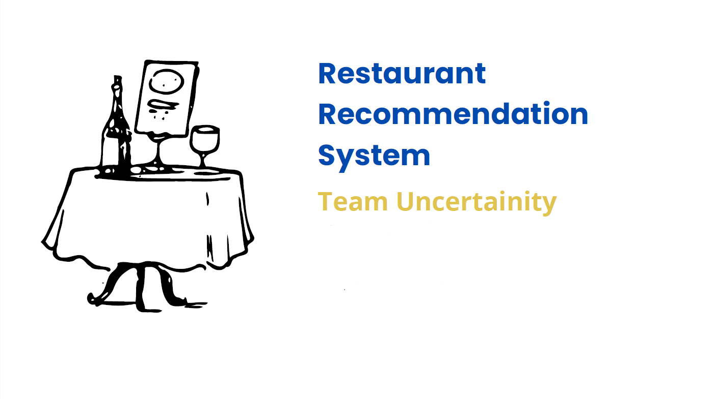
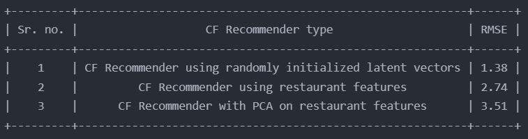

# Restaurant-Recommendation-System
- A collaborative filter based recommendation system trained by Stochastic Gradient Descent on Yelp business dataset.
- Experimented with multiple approaches to creating latent user and restaurant embeddings
and achieved a 1.4 RMSE on a randomized test dataset.

## Presentation

## Result
